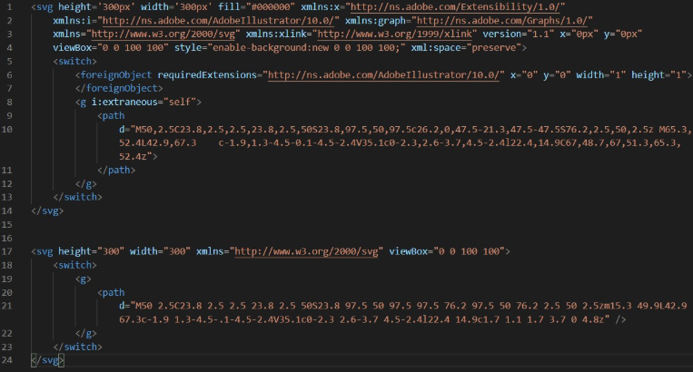

# JSX와 바벨

```javascript
const App = (
  <div>
    <h1 className="primary">simsimreact</h1>
    <p>100줄 이하의 자바스크립트로 리액트 코어를 클론해봅시다.</p>
  </div>
);
```

이렇게 생긴 JSX는 **@babel/plugin-transform-react-jsx** 플러그인에 의해서 다음과 같이 변경됩니다.

```javascript
var App = React.createElement(
  "div",
  null,
  React.createElement(
    "h1",
    {
      className: "primary"
    },
    "simsimreact"
  ),
  React.createElement(
    "p",
    null,
    "100줄 이하의 자바스크립트로 리액트 코어를 클론해봅시다."
  )
);
```

우리도 JSX를 우리만의 함수로 변경시키기 위해서 바벨 플러그인을 설치합시다.

```bash
npm install @babel/plugin-transform-react-jsx
```

그리고 .babelrc에 다음을 추가해줍니다.

```javascript
{
  "plugins": [
    ["@babel/plugin-transform-react-jsx", {
      "pragma": "simsimReact.createElement", // 기본값은 React.createElement
      "throwIfNamespace": false 
    }]
  ]
}
```

throwIfNamespace란? JSX 스펙에서는 허용되지만 React에서는 허용되지 않는 JSX인 경우 에러를 throw할건지 말건지 결정하는 옵션 기본적으로는 에러를 throw합니다. 



예를들어서,  위 이미지에서 svg내의 foreignObject와 같은 JSX는 표준 JSX 스펙에서는 허용되지만 리액트에서는 해석할 수 없는 JSX입니다. 따라서 에러를 기본적으로 throw하게 만들어둔것입니다. 그래서 아래와 같이 리액트에서 해석할 수 있는 JSX만 변환할수 있도록 옵션을 켜주시면 됩니다.

이제 바벨로 우리의 코드를 빌드하면 JSX를 만날때마다 JSX가 **simsimReact.createElement\(...\)** 함수 호출로 변환됩니다.

