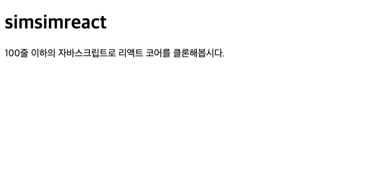

# virtualDOM을 realDOM에 반영하기

**아래 내용들은 src/simsimReactDOM.js에 작성되어 있습니다.**

```javascript
const simsimReactDom = {
  render : (virtualDom, realDom) => {
      // 이곳에 가상돔을 리얼돔에 반영하는 코드를 작성합니다.
  }
};

export default simsimReactDom;
```

render함수 내부를 채우기 전에 **snabbdom**을 초기화 해줘야 합니다. snabbdom의 모듈들은 일종의 플러그인이라고 생각하면 됩니다.

```javascript
import { init } from 'snabbdom/build/package/init';
import { propsModule } from 'snabbdom/build/package/modules/props';

// snabbdom에 props모듈을 붙여 초기화함.
// 이 모듈 덕분에 props를 가진 가상돔을 만들 수 있게 되었음.
const reconcile = init([propsModule]);

const simsimReactDom = {
    render: (virtualDom, realDom) => {
        reconcile(realDom, virtualDom);
    },
};

export default simsimReactDom;
```

reconcile 함수를 실행하면 realDom에 virtualDom을 반영합니다.\(patch\)

자 이제 우리가 만든 react dom으로 여지껏 만든 virtual DOM을 실제로 화면에 렌더링 해볼까요?



화면에 정상적으로 렌더링이 되었습니다.

